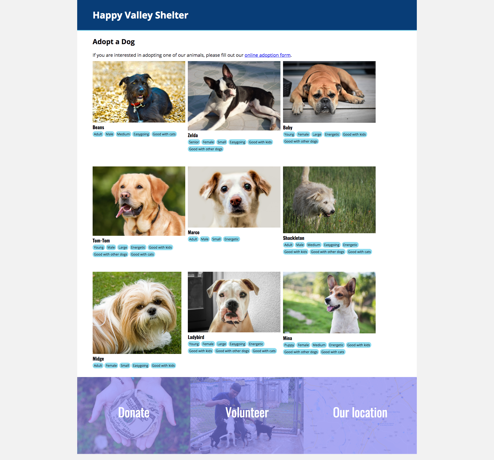

# Dog Adoption Site

## Project Goals

To build one page site for an animal shelter. This project will be my first experience with HTML and CSS to create a smooth, responsive page that mimics the following design:

## ToDos
* Less space for attributes
* Wrap attributes so they don't split up